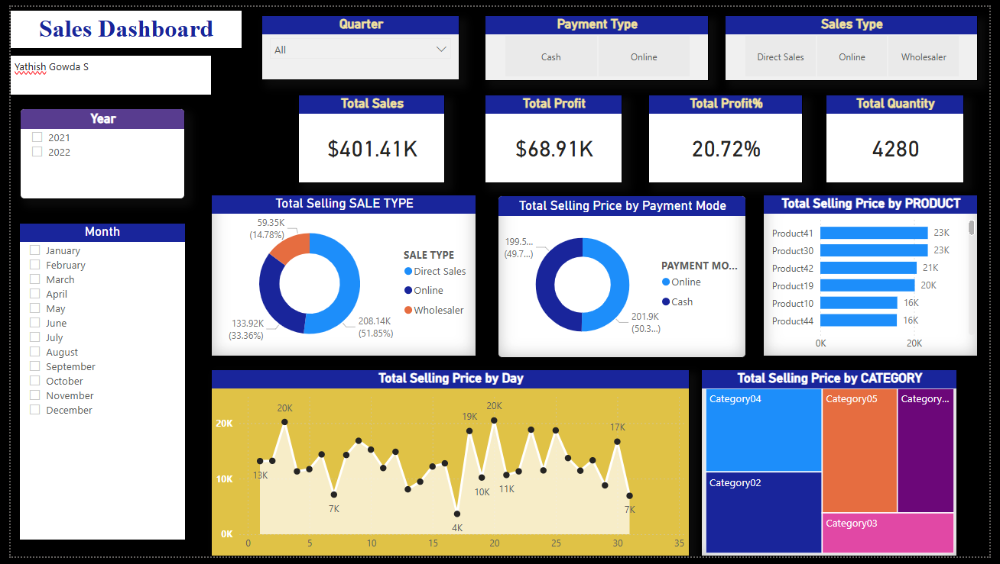

# 📊 Sales Dashboard (Power BI)

## 📌 Overview
This project showcases an end-to-end interactive **Sales Dashboard** built in Power BI Desktop using a sales dataset. It demonstrates data transformation, modeling, DAX calculations, and professional dashboard design with interactive visuals.

---

## 🎯 Objective
- Analyze sales performance across different dimensions
- Track profit and profitability percentage
- Enable dynamic filtering using slicers
- Visualize trends by time, category, and product attributes
- Build a professional, interactive dashboard

---

## 📂 Dataset
The dataset consists of two tables:

### 🔹 Input (Transactional Data)
- Date  
- Product ID  
- Quantity  
- Selling Price  
- Buying Price  
- Payment Mode  
- Selling Type  

### 🔹 Master (Reference Data)
- Product ID  
- Product Device  
- Category  

---

## ⚙️ Data Preparation (Power Query)

### Steps performed:
- Imported Excel dataset into Power BI
- Changed data types:
  - Date → Date format  
  - Quantity → Whole number  
  - Prices → Decimal/Currency  
- Merged tables:
  - Joined **Input** with **Master** using Product ID (Left Outer Join)
- Expanded columns:
  - Product Device  
  - Category  
- Removed unnecessary columns

### ➕ Created Custom Columns:
```DAX
Total Buying Price = [Quantity] * [Buying Price]

Total Selling Price = [Quantity] * [Selling Price]
```

- Applied changes using **Close & Apply**

---

## 🧮 Measures Created

```DAX
Total Sales = SUM('Input'[Total Selling Price])

Total Profit = 
SUM('Input'[Total Selling Price]) - SUM('Input'[Total Buying Price])

Profit Percentage = 
DIVIDE([Total Profit], SUM('Input'[Total Buying Price]), 0)

Total Quantity = SUM('Input'[Quantity])
```

---

## 🧩 Dashboard Components

### 🏷️ Title
**Sales Dashboard**
- Font Size: 24  
- Bold  
- Background Color applied  
- Shadow effect enabled  
- Center aligned  

---

### 📌 KPI Cards
- Total Sales  
- Total Profit  
- Profit Percentage  
- Total Quantity  

✔ Features:
- Titles enabled  
- Borders & shadows  
- Proper formatting (Currency, %, Numbers)

---

### 🎛️ Slicers (Filters)
- Quarter (Dropdown)  
- Payment Mode  
- Sales Type (Selling Type)  
- Year (Vertical list)  
- Month (Vertical list)  

✔ Features:
- Titles enabled  
- Borders & shadows  
- No headers  
- Fully interactive  

---

## 📊 Visualizations

1. **Donut Chart – Sales by Selling Type**  
2. **Donut Chart – Sales by Payment Mode**  
3. **Donut Chart – Sales by Product Device**  
4. **Area Chart – Sales Trend by Day**  
5. **Treemap – Sales by Category**  

✔ Formatting:
- Data labels enabled  
- Borders & shadows applied  
- Consistent dark theme  

---

## 🖼️ Dashboard Preview



## 🔍 Key Insights
- Certain payment modes contribute more to total sales  
- Specific product categories dominate revenue  
- Profit percentage varies across time periods  
- Sales trends show peak periods during specific dates  

---

## ⚠️ Challenges Faced
- Correct implementation of Left Outer Join  
- Handling missing or inconsistent data  
- Creating accurate Profit % using DAX  
- Designing a clean and consistent UI  

---

## 💾 File
**SalesDashboard.pbix**

---

## 🚀 How to Use
1. Open the `.pbix` file in Power BI Desktop  
2. Use slicers to filter data dynamically  
3. Hover over visuals for detailed insights  
4. Analyze trends across categories, devices, and time  

---
